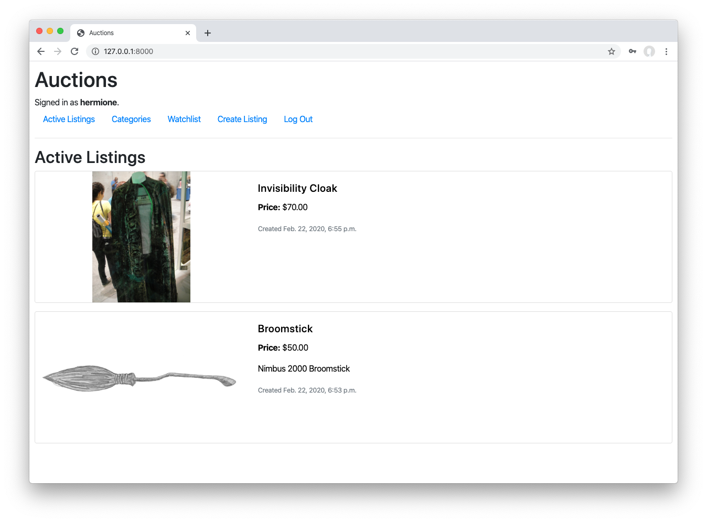
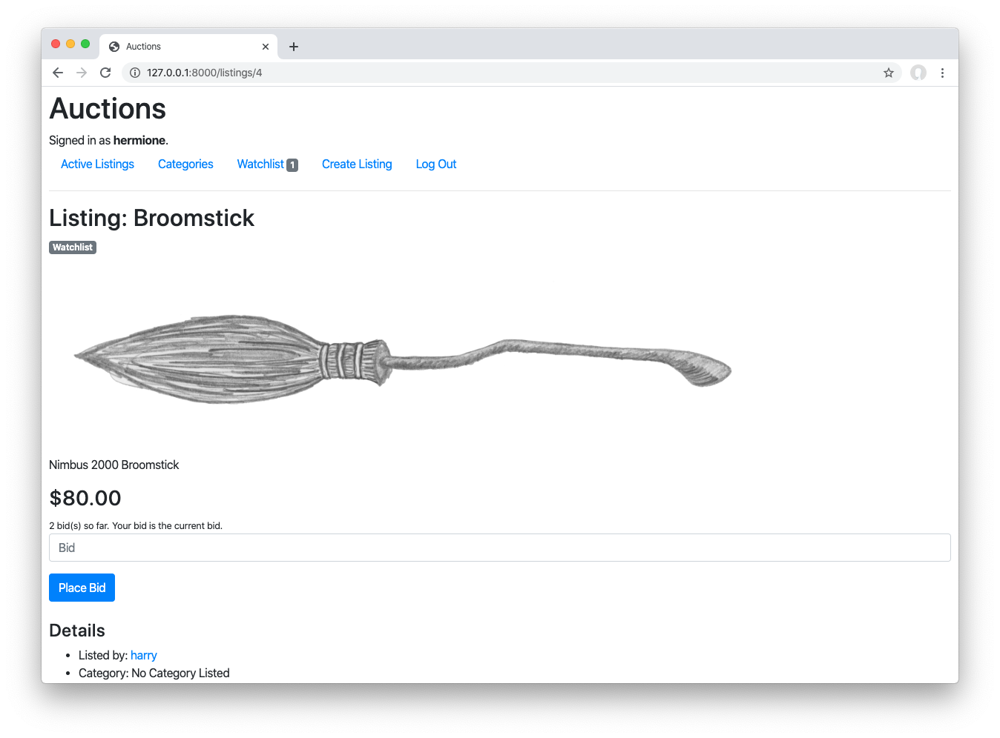

# eBay-like E-Commerce Auction Site

## Overview

The eBay-like e-commerce auction site project aims to create a web application where users can post auction listings, place bids on listings, comment on listings, and add listings to a "watchlist." This project is inspired by the functionalities offered by eBay, a popular online marketplace.

## Project Features

1. **User Authentication**: Implement user authentication to allow users to sign up, log in, and log out of their accounts.

2. **Listing Creation**: Enable users to create new auction listings by providing necessary details such as title, description, starting bid, etc.

3. **Listing Bidding**: Allow users to place bids on existing auction listings. Each bid should be associated with the user who placed it and the listing it pertains to.

4. **Listing Comments**: Implement a commenting system where users can leave comments on auction listings. Comments should be associated with the user who made them and the listing they pertain to.

5. **Watchlist**: Provide functionality for users to add listings to their watchlist, allowing them to keep track of listings they are interested in.

## Technologies Used

- **Django**: Utilize the Django web framework for building the backend of the application.
- **HTML/CSS**: Use HTML and CSS for structuring and styling the frontend components.
- **JavaScript**: Employ JavaScript to enhance user interactivity and implement dynamic features.
- **Bootstrap**: Utilize Bootstrap framework for responsive design and UI components.
- **SQLite Database**: Use SQLite as the database management system for storing user data, listings, bids, comments, etc.

## Implementation Plan

1. **Project Setup**: Set up the Django project structure and configure necessary settings such as database connections, static files, and templates.

2. **User Authentication**: Implement user authentication functionality for user registration, login, and logout.

3. **Listing Creation**: Create views and forms for users to create new auction listings.

4. **Listing Bidding**: Implement functionality for users to place bids on existing auction listings.

5. **Listing Comments**: Develop a commenting system allowing users to leave comments on auction listings.

6. **Watchlist**: Implement features for users to add listings to their watchlist and view watched listings.

7. **Frontend Styling**: Use HTML, CSS, and Bootstrap to style and design the frontend components for a visually appealing interface.

8. **Testing and Debugging**: Test the application thoroughly to ensure all features work as intended. Debug any issues encountered during testing.

## Conclusion

The eBay-like e-commerce auction site project provides an opportunity to build a comprehensive web application with user authentication, auction listing management, bidding, commenting, and watchlist functionalities. By leveraging Django and other web technologies, we can create a robust and user-friendly platform for online auctions.
