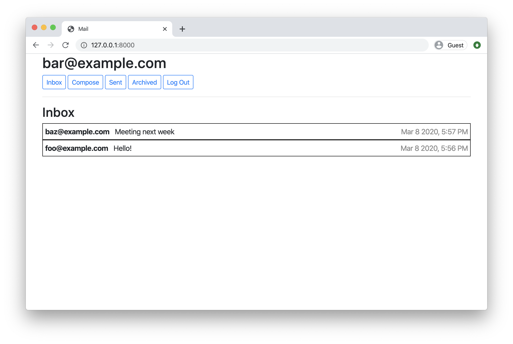
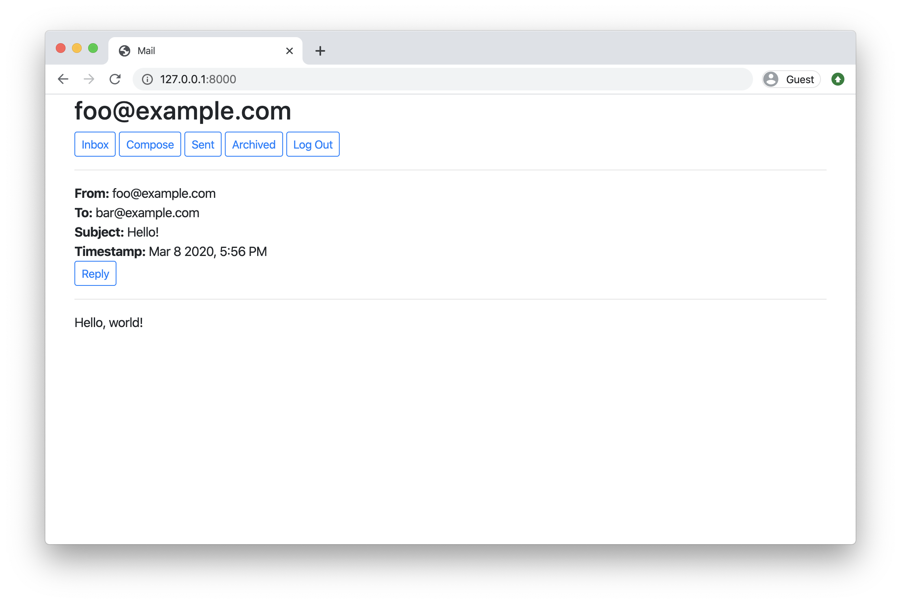

# Mail Project

## Overview

The Mail project is a web application designed to simulate an email client. It allows users to send, receive, and manage emails similar to popular email services such as Gmail or Yahoo Mail.

## Project Features

1. **User Authentication**: Implement user authentication to allow users to sign up, log in, and log out of their accounts.

2. **Mailbox**: Create different mailboxes for displaying received emails, sent emails, and archived emails.

3. **Email Composition**: Enable users to compose new emails by providing recipient(s), subject, and message body.

4. **Email Viewing**: Allow users to view individual emails, including details such as sender, recipients, subject, timestamp, and message body.

5. **Email Reply**: Implement the ability for users to reply to emails, preserving the original email's subject and including quoted content in the reply.

6. **Email Archive**: Provide functionality for users to archive and unarchive emails, allowing them to organize their inbox effectively.

7. **Email Deletion**: Allow users to delete individual emails or entire conversations from their mailbox.

8. **Read/Unread Status**: Display unread emails prominently and allow users to mark emails as read or unread.

## Technologies Used

- **Django**: Utilize the Django web framework for building the backend of the application.
- **HTML/CSS**: Use HTML and CSS for structuring and styling the frontend components.
- **JavaScript**: Employ JavaScript to enhance user interactivity and implement dynamic features.
- **Bootstrap**: Utilize Bootstrap framework for responsive design and UI components.
- **SQLite Database**: Use SQLite as the database management system for storing user data, emails, mailbox contents, etc.

## Implementation Plan

1. **Project Setup**: Set up the Django project structure and configure necessary settings such as database connections, static files, and templates.

2. **User Authentication**: Implement user authentication functionality for user registration, login, and logout.

3. **Mailbox Views**: Create views for displaying different mailbox categories such as inbox, sent, archived, and trash.

4. **Email Composition**: Develop forms and views for composing new emails, with validation for recipient(s) and subject.

5. **Email Viewing**: Implement views for displaying individual email details, including sender, recipients, subject, and message body.

6. **Email Reply**: Create functionality for replying to emails, including quoting original content in the reply.

7. **Email Archive and Deletion**: Implement features for archiving, unarchiving, and deleting emails.

8. **Read/Unread Status**: Develop functionality to mark emails as read or unread based on user interaction.

9. **Frontend Styling**: Use HTML, CSS, and Bootstrap to style and design the frontend components for a visually appealing interface.

10. **Testing and Debugging**: Test the application thoroughly to ensure all features work as intended. Debug any issues encountered during testing.

## Conclusion

The Mail project provides a comprehensive exploration of web application development by implementing core functionalities of an email client. By leveraging Django and other web technologies, we can create a robust and user-friendly platform for managing emails effectively.
