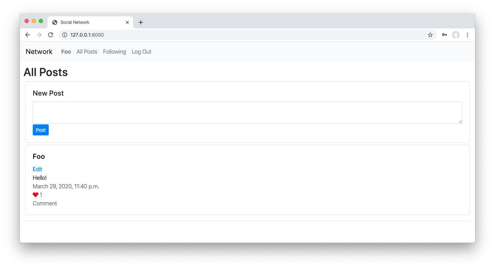

# Network Project

## Overview

The Network project is a social media web application designed to create and manage user profiles, post messages, follow other users, and interact with posts. It simulates a simplified version of popular social networking platforms like Twitter or Facebook.

## Project Features

1. **User Authentication**: Implement user authentication to allow users to sign up, log in, and log out of their accounts.

2. **User Profile**: Create user profiles where users can view and update their information, such as username, bio, profile picture, etc.

3. **Post Creation**: Enable users to create new posts, including text-based messages or image-based posts.

4. **Post Viewing**: Allow users to view individual posts, including details such as author, timestamp, content, and comments.

5. **Post Interaction**: Provide functionality for users to like and unlike posts, as well as to comment on posts.

6. **Following System**: Implement a following system allowing users to follow/unfollow other users. Users can view posts from users they follow on their feed.

7. **Pagination**: Implement pagination for displaying posts, comments, and user profiles to manage large amounts of data efficiently.

8. **Notifications**: Provide notification functionality to inform users about new followers, likes, and comments on their posts.

## Technologies Used

- **Django**: Utilize the Django web framework for building the backend of the application.
- **HTML/CSS**: Use HTML and CSS for structuring and styling the frontend components.
- **JavaScript**: Employ JavaScript to enhance user interactivity and implement dynamic features.
- **Bootstrap**: Utilize Bootstrap framework for responsive design and UI components.
- **SQLite Database**: Use SQLite as the database management system for storing user data, posts, comments, followers, etc.

## Implementation Plan

1. **Project Setup**: Set up the Django project structure and configure necessary settings such as database connections, static files, and templates.

2. **User Authentication**: Implement user authentication functionality for user registration, login, and logout.

3. **User Profile**: Create views and forms for displaying and updating user profiles, including profile pictures.

4. **Post Creation and Viewing**: Develop functionality for creating new posts and viewing individual posts.

5. **Post Interaction**: Implement features for liking/unliking posts and commenting on posts.

6. **Following System**: Create views and functionality for users to follow/unfollow other users.

7. **Pagination**: Implement pagination for displaying large lists of posts, comments, and user profiles.

8. **Notifications**: Develop notification functionality to notify users about new followers, likes, and comments.

9. **Frontend Styling**: Use HTML, CSS, and Bootstrap to style and design the frontend components for a visually appealing interface.

10. **Testing and Debugging**: Test the application thoroughly to ensure all features work as intended. Debug any issues encountered during testing.

## Conclusion

The Network project provides a comprehensive exploration of web application development by implementing core functionalities of a social media platform. By leveraging Django and other web technologies, we can create a robust and user-friendly platform for users to connect, share, and interact with each other.
